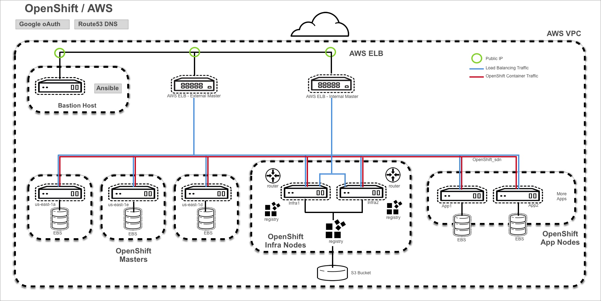

# The Reference Architecture OpenShift on Amazon Web Services
This repository contains the scripts used to deploy an OpenShift environment based off of the Reference Architecture Guide for OpenShift 3.2 on Amazon Web Services.

## Overview
The repository contains both a bash script option and a grouping of Ansible playbooks which deploy 3 Masters in different availability zones, 2 infrastructure nodes and 2 applcation nodes. The Infrastrucute and Application nodes are split between two availbility zones.  The playbooks deploy a Docker registry and scale the router to the number of Infrastruture nodes.  Either method can be used to deploy the infrastucture. If using the bash installation the openshift-install.yaml will need to be launched once the environment deploys.



## Prerequisites
A registered domain must be added to Route53 as a Hosted Zone before installation.  This registered domain can be purchased through AWS.

### GitHub Repositories
The code in this repository handles all of the AWS specific components except for the installation of OpenShift. We rely on the OpenShift installer which lives in a separate repository. You will need both of
them to perform the installation using ose-on-aws.py.

- `openshift-ansible`
    - [openshift/openshift-ansible](https://github.com/openshift/openshift-ansible)
    - You will want to check out branch `enterprise-3.2`

The folders for these repositories are expected to live in the same
subdirectory. An example tree structure is below:
```
/home/user/git/
|-- openshift-ansible-contrib
|-- openshift-ansible
```

In this case, you could do something like the following:
```
cd /home/user/git
git clone https://github.com/openshift/openshift-ansible-contrib.git
git clone https://github.com/openshift/openshift-ansible.git
cd openshift-ansible
git checkout enterprise-3.2
```
