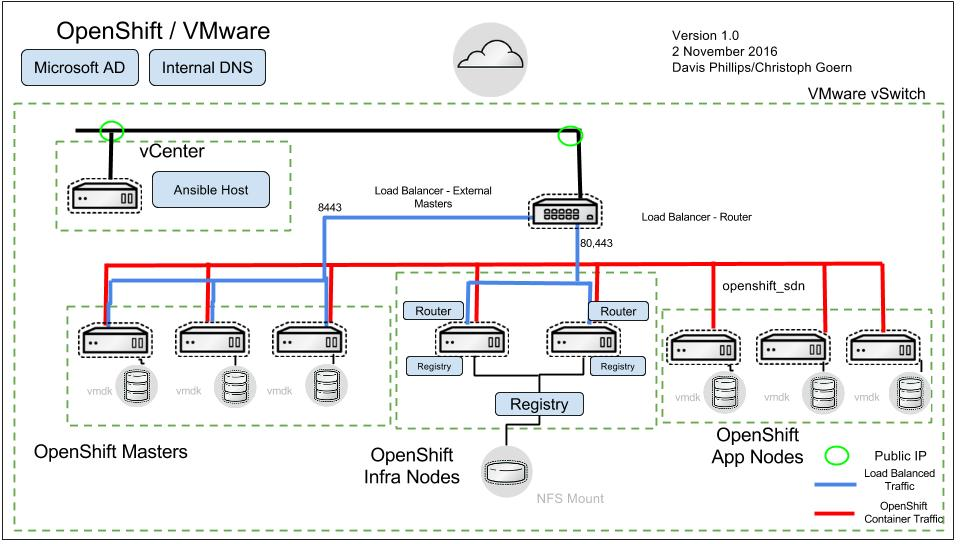

# The Reference Architecture OpenShift on VMware
This repository contains the scripts used to deploy an OpenShift environment based off of the Reference Architecture Guide for OpenShift 3.6 on VMware

## Overview
The repository contains Ansible playbooks which deploy 3 Masters, 2 infrastructure nodes and 3 application nodes. All nodes could utilize anti-affinity rules to separate them on the number of hypervisors you have allocated for this deployment. The playbooks deploy a Docker registry and scale the router to the number of Infrastruture nodes. Please see the [TLDR](README.md#TLDR:-Steps-to-install-Red-Hat-OpenShift-Cluster-Platform) bottom section if you just want the concise deployment steps.



## Prerequisites
Internal DNS should be set up to reflect the number of nodes in the environment. The default "VM network" should have a contiguous static IP addresses set up for initial provisioning.

### OpenShift Playbooks
The code in this repository handles all of the VMware specific components except for the installation of OpenShift. We rely on the OpenShift playbooks from the openshift-ansible-playbooks rpm. You will need the rpm installed on the workstation before using ocp-on-vmware.py.
```bash
wget https://raw.githubusercontent.com/openshift/openshift-ansible-contrib/vmw-3.6/reference-architecture/vmware-ansible/scripts/setup_ansible.sh
```

The following commands can be executed by themselves or via the script ./setup_ansible.sh

```bash
echo "Subscribing and enabling the repos we need for deployment"
subscription-manager attach --pool=`subscription-manager list --available --pool-only --matches="Red Hat OpenShift Container Platform, Premium*" | tail -n1`
subscription-manager repos --enable=rhel-7-fast-datapath-rpms
subscription-manager repos --enable=rhel-server-rhscl-7-rpms
subscription-manager repos --enable=rhel-7-server-ose-3.6-rpms
subscription-manager repos --enable=rhel-7-server-rpms
subscription-manager repos --enable=rhel-7-server-extras-rpms

echo "Enabling the python27 SCL and use it for most of our packaging needs"
yum install -y python27

echo "Installing the base packages that are needed for deployment minus the ones that are only on EPEL"
yum install -y git atomic-openshift-utils python-click python-ldap ansible-2.3

echo "Installing the EPEL repo and then EPEL packages needed"
rpm -Uvh https://dl.fedoraproject.org/pub/epel/epel-release-latest-7.noarch.rpm
yum install -y python-iptools python2-pyvmomi

echo "Creating a ~/git directory and cloning the vmw-3.6 branch into it"
mkdir ~/git/; cd ~/git/
git clone -b vmw-3.6 https://github.com/openshift/openshift-ansible-contrib

echo "Please fill in your variables ~/git/openshift-ansible-contrib/reference-architecture/vmware-ansible/ocp-on-vmware.ini"
echo "Create the initial inventory with the following command ~/git/openshift-ansible-contrib/reference-architecture/vmware-ansible/ocp-on-vmware.py --create_inventory"
echo "Create the OCP install vars with the following command ~/git/openshift-ansible-contrib/reference-architecture/vmware-ansible/ocp-on-vmware.py --create_ocp_vars"
echo "Lastly, run ~/git/openshift-ansible-contrib/reference-architecture/vmware-ansible/ocp-on-vmware.py to complete and test the OCP install"    
```

## Usage
The Ansible script will launch infrastructure and flow straight into installing the OpenShift application and components.

### Before Launching the Ansible script
Before launching the ansible scripts ensure that your ssh keys are imported properly. Your private key should be located in **ssh_keys/ocp-installer**. Make sure your public key is copied to your template.

```bash
ssh-keygen

cp ~/.ssh/id_rsa ~/git/openshift-ansible-contrib/reference-architecture/vmware-ansible/ssh_key/ocp-installer

```

Additionally, you will need to use ocp-on-vmware.py to configure your LDAP authentication credentials for the OpenShift install and to create your inventory to define the number of nodes for each **role**: *app, infra, master*. Also, the *create inventory* tag will help you with your DNS configuration and will allow you to assign a starting static IP address point for your configuration.

### VMware Template Name
This is your VMware template name. The template should be configured with open-vm-tools installed on RHEL 7.4. The template should have your public key listed in its authorized_keys section.

### New VMware Environment (Greenfield)
When installing all components into your VMware environment perform the following. This will create the haproxy, the nfs server for the registry, and all the production OpenShift VMs. Additionally, the installer script will attempt to copy your existing public key to the VMs.

```bash
$ cd ~/git/openshift-ansible-contrib/reference-architecture/vmware-ansible/

$ vim ~/git/openshift-ansible-contrib/reference-architecture/vmware-ansible/ocp-on-vmware.ini

[vmware]
# console port and install type for OpenShift
console_port=8443
# choices are: openshift-enterprise or origin
deployment_type=openshift-enterprise

# vCenter host address/username and password
vcenter_host=myvcenter.example.com
vcenter_username=administrator@vsphere.local
vcenter_password=password

... ommitted ...

./ocp-on-vmware.py  \

Configured values:
    console port: 8443
    deployment_type: openshift-enterprise
    vcenter_host: 10.x.x.25
    vcenter_username: administrator@vsphere.local
    vcenter_password: *******
    vcenter_template_name: ocp-server-template-2.0.2
    vcenter_folder: ocp
    vcenter_cluster: devel
    vcenter_datacenter: Boston
    vcenter_resource_pool: OCP3
    public_hosted_zone: vcenter.example.com
    app_dns_prefix: apps
    vm_dns: 10.x.x.5
    vm_gw: 10.x.x.254
    vm_netmask: 255.255.255.0
    byo_lb: no
    lb_host: haproxy-0.vcenter.example.com
    byo_nfs: no
    nfs_registry_host: nfs-0.vcenter.example.com
    nfs_registry_mountpoint: /exports
    apps_dns: apps.vcenter.example.com
    Using values from: ./ocp-on-vmware.ini

Continue using these values? [y/N]:
```

### Existing VM Environment and Deployment (Brownfield)
The `ocp-on-vmware.py` script allows for deployments into an existing environment
in which VMs already exists and are subscribed to the proper `RHEL` [channels].(https://access.redhat.com/documentation/en/openshift-container-platform/3.3/single/installation-and-configuration/#installing-base-packages)
The prerequisite packages will be installed. The script expects the proper VM annotations are created on your VMs:

* app nodes will be labeled **"app"** 
* infra nodes labeled **"infra"**
* master nodes labeled as **"master"**

Lastly, the prepared VMs must also have 2 additional hard disks as the OpenShift setup needs those
for both docker storage and OpenShift volumes.


The *ocp-install* tag will install OpenShift on your pre-existing environment. The dynamic inventory script sorts your VMs by their annotations and that is how the proper OpenShift labels are applied.

The *ocp-configure* tag will configure your persistent registry and scale your nodes.

Notice in the instance below we are supplying our own external NFS server and load balancer.

```bash
$ cd ~/git/openshift-ansible-contrib/reference-architecture/vmware-ansible/

$ vim /home/<user>/git/openshift-ansible-contrib/reference-architecture/vmware-ansible/ocp-on-vmware.ini

... content abbreviated ...

# bringing your own load balancer?
byo_lb=yes
lb_host=my-load-balancer.lb.example.com

# bringing your own NFS server for registry?
byo_nfs=yes
nfs_registry_host=my-nfs-server.nfs.example.com
nfs_registry_mountpoint=/my-registry

... content abbreviated ...

./ocp-on-vmware.py  \
--tag ocp-install,ocp-configure

Configured values:
    console port: 8443
    deployment_type: openshift-enterprise
    vcenter_host: 10.*.*.25
    vcenter_username: administrator@vsphere.local
    vcenter_password: *******
    vcenter_template_name: ocp-server-template-2.0.2
    vcenter_folder: ocp
    vcenter_cluster: devel
    vcenter_datacenter: Boston
    vcenter_resource_pool: OCP3
    public_hosted_zone: vcenter.e2e.bos.redhat.com
    app_dns_prefix: apps
    vm_dns: 10.19.114.5
    vm_gw: 10.19.115.254
    vm_netmask: 255.255.254.0
    byo_lb: yes
    lb_host: my-load-balancer.lb.example.com
    byo_nfs: yes
    nfs_registry_host: my-nfs-server.nfs.example.com
    nfs_registry_mountpoint: /my-registry
    apps_dns: apps.vcenter.e2e.bos.redhat.com
    Using values from: ./ocp-on-vmware.ini

Continue using these values? [y/N]:

```
### Adding a node to an existing OCP cluster

### Container Storage

#### Using CNS - Container native storage
docs go here

#### Using CRS - Container ready storage
docs go here

### TLDR: Steps to install Red Hat OpenShift Cluster Platform

* Clone the git repo and run the script in setup.

```bash
$ cd ~ && git clone https://github.com/openshift/openshift-ansible-contrib && \
sh ~/openshift-ansible-contrib/reference-architecture/vmware-ansible/scripts/setup_ansible.sh
```

* Fill out the variables in the ocp-on-vmware.ini file.

```bash
$ vim ~/openshift-ansible-contrib/reference-architecture/vmware-ansible/ocp-on-vmware.ini
```
* Run ocp-on-vmware.py with --create_ocp_vars.

```bash
$ cd ~/openshift-ansible-contrib/reference-architecture/vmware-ansible/ && ./ocp-on-vmware.py --create_ocp_vars
```
* Run ocp-on-vmware.py with --create_inventory.

```bash
$ cd ~/openshift-ansible-contrib/reference-architecture/vmware-ansible/ && ./ocp-on-vmware.py --create_inventory
```
* Run ocp-on-vmware.py by itself.

```bash
$ cd ~/openshift-ansible-contrib/reference-architecture/vmware-ansible/ && ./ocp-on-vmware.py
```
* Test the install by running ocp-on-vmware.py --tag ocp-demo

```bash
$ cd ~/openshift-ansible-contrib/reference-architecture/vmware-ansible/ && ./ocp-on-vmware.py --tag ocp-demo
```

* Update the install by running ocp-on-vmware.py --tag ocp-update

```bash
$ cd ~/openshift-ansible-contrib/reference-architecture/vmware-ansible/ && ./ocp-on-vmware.py --tag ocp-update
```
If you have installation failures during the ./ocp-on-vmware.py run by itself, you can
simply rerun it.
